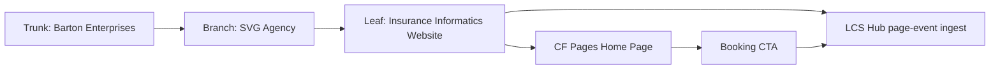

# Insurance Informatics Website
## CF Pages home page and B2B performance implementation for `insuranceinformatics.com`
### Status: BUILD
### Medium: process
### Business: svg-agency

---

## UT Checklist (Pre-Flight - per `law/UT_CHECKLIST.md`)

| # | Check | Status | Location |
|---|-------|--------|----------|
| 1 | PRD - what / why / who / scope / out-of-scope / success metric | [x] | Section 2 |
| 2 | OSAM - READ / WRITE / Join Chain / Forbidden Paths / Query Routing filled | [x] | Section 5 |
| 3 | Component Status - every dependency has green / yellow / red with 1-line state | [x] | Section 3 |
| 4 | Owner - human who fixes this at 2 AM | [x] | Section 1 |
| 5 | Live Dashboard - URL or explicit "N/A" | [x] | Section 3 |
| 6 | Kill Switch - exact command to stop the process | [x] | Section 8 |
| 7 | Logbook - last audit verdict + date (after certification only) | [x] | Section 12 |
| 8 | FCEs Attached - which FCE runs structurally back this doc | [x] | Section 3c |
| 9 | BARs Referenced - every BAR this doc touches, with status | [x] | Section 3d |
| 10 | LBB Subjects Fed - which LBB subject(s) this doc's session logs go to | [x] | Section 3e |
| 11 | Geometry - CTB position + Hub-Spoke role + Altitude | [x] | Section 1b |
| 12 | Live Verification - every numeric count, cron, URL, command, BAR status grounded against the actual system | [x] | Section 9b |
| 13 | ctb_node - declared path on Barton Enterprises CTB trunk | [x] | Section 1 |

---

# IDENTITY (Thing - what this IS)

## 1. IDENTITY

| Field | Value |
|-------|-------|
| ID | PROC-II-WEBSITE |
| Name | Insurance Informatics Website Implementation |
| Medium | process |
| Business Silo | svg-agency |
| CTB Position | leaf -> fleet/content/INSURANCE-INFORMATICS-WEBSITE-UT.md |
| ORBT | BUILD |
| Strikes | 0 |
| Authority | inherited - `fleet/content/VOICE-SPEC.yaml`, `fleet/content/INSURANCE-INFORMATICS-CTB.md`, `docs/dispatches/session-31/IMPLEMENTATION-BRIEF.md` |
| Last Modified | 2026-04-21 |
| BAR Reference | BAR-302 |
| Owner | Dave Barton |
| ctb_node | barton-enterprises/svg-agency/content/insurance-informatics-website |

### 1b. Geometry

**CTB Position:** `barton-enterprises/svg-agency/content/insurance-informatics-website`

**Hub-Spoke Role:** Hub. This doc is the middle layer for the website build and the page-event tracking contract.

**Altitude:** 30k tactical. It sits above the worker implementation and below the business brief.



### HEIR (8 fields - Aviation Model, Bedrock S8)

| Field | Value |
|-------|-------|
| sovereign_ref | imo-creator |
| hub_id | insurance-informatics-website |
| ctb_placement | leaf |
| imo_topology | middle |
| cc_layer | CC-03 |
| services | workers/content-pages, workers/lcs-hub, fleet/content/VOICE-SPEC.yaml, fleet/content/INSURANCE-INFORMATICS-CTB.md |
| secrets_provider | none |
| acceptance_criteria | The CF Pages home route reflects the FCE-007 website constants, the voice spec is applied to the copy, the 9-slot content page is populated with one documented-empty audio slot during ramp, and CTA/page events flow to LCS Hub |

---

## 2. PURPOSE (PRD)

### WHAT
This doc packages the Insurance Informatics home page implementation: route mapping, voice-locked copy, 9-slot content instantiation, and page-event tracking into LCS Hub.

### WHY
Without this, the website stays a static brochure. With it, the site becomes a performance surface that names the discipline, explains the mechanism, and captures conversion intent.

### WHO
- Prospects who land on `insuranceinformatics.com`
- Dave Barton and the sales process
- Auditors checking that the site obeys the voice spec and FCE-007 constants

### SCOPE
- Build a dedicated Insurance Informatics home page in `workers/content-pages`
- Add a brand wordmark and supporting SVG assets
- Add page load and CTA event tracking to LCS Hub
- Record the page content in `fleet/content/INSURANCE-INFORMATICS-WEBSITE.md`

### OUT OF SCOPE
- Editing the locked constants
- Editing the Dyno folder
- Rewriting the broader CTB docs
- Changing the actual domain registration

### SUCCESS METRIC
The home page answers the question "what is Insurance Informatics?" in direct language, shows one clear CTA, and records page / CTA events in LCS Hub.

---

## 3. RESOURCES

### Component Status Grid

| Component | HEIR | ORBT | State | Notes |
|-----------|------|------|-------|-------|
| `workers/content-pages/src/App.tsx` | `content-pages-router · leaf · CC-03` | BUILD | green | Root route now points to the Insurance Informatics home page |
| `workers/content-pages/src/components/ContentPage.tsx` | `content-page-renderer · leaf · CC-03` | BUILD | green | Renders CTA and emits page events |
| `workers/content-pages/src/configs/insurance-informatics-home.ts` | `ii-home-config · leaf · CC-03` | BUILD | green | 9-slot page config with voice-locked copy and generated voice-spec bridge |
| `workers/content-pages/public/content/insurance-informatics/*` | `ii-assets · leaf · CC-03` | BUILD | green | SVG assets for the populated slots; audio remains documented empty during ramp |
| `workers/lcs-hub/src/index.ts` | `lcs-hub · leaf · CC-04` | BUILD | green | Page-event ingest route |
| `fleet/content/INSURANCE-INFORMATICS-WEBSITE.md` | `ii-website-doc · leaf · CC-03` | BUILD | green | Content artifact for the page |
| `fleet/content/VOICE-SPEC.yaml` | `voice-spec · leaf · CC-03` | BUILD | green | Voice contract consumed by the page copy |
| `fleet/content/INSURANCE-INFORMATICS-CTB.md` | `ii-ctb · leaf · CC-03` | BUILD | green | Positioning backbone |

### Live Dashboard

| Resource | URL | What it shows |
|----------|-----|---------------|
| CF Pages app | N/A in repo | Built from `workers/content-pages` |
| LCS Hub ingest | https://lcs-hub.svg-outreach.workers.dev/page-event | Records page and CTA events |

### Dependencies

| Dependency | Type | What It Provides | Status |
|-----------|------|-----------------|--------|
| `fleet/content/VOICE-SPEC.yaml` | document | Tone, forbidden phrases, required phrases | DONE |
| `fleet/content/INSURANCE-INFORMATICS-CTB.md` | document | Altitude and content backbone | DONE |
| `docs/dispatches/session-31/IMPLEMENTATION-BRIEF.md` | brief | Thread 4 requirements | DONE |
| `workers/content-pages` | worker | CF Pages render surface | DONE |
| `workers/lcs-hub` | worker | Conversion event sink | DONE |

### Downstream Consumers

| Consumer | What It Needs |
|----------|--------------|
| Website visitor | Direct explanation and one CTA |
| Sales process | Page events and CTA intent |
| Audit pass | Proof that the copy follows the voice spec and the FCE constants |

### Tools & Integrations

| Item | Type | Cost Tier | Credentials | What It Does |
|------|------|-----------|-------------|-------------|
| CF Pages | deploy surface | existing | none | Hosts the page |
| Cloudflare Workers | runtime | existing | none | Serves the LCS event ingest route |
| LCS Hub | ingest sink | existing | none | Stores page and CTA events |

### Secrets

| Secret | Needed | Notes |
|--------|--------|-------|
| none | no | The page uses a public booking link and a public ingest endpoint |

### 3c. FCEs Attached

| FCE Name | HEIR | ORBT | Run Directory | Latest P=1 | Rows | Status |
|----------|------|------|--------------|------------|------|--------|
| FCE-007 | `fce-007 · trunk · CC-03` | BUILD | `factory/agents/up/dyno-runs/us/fce-007-website-seo` | yes | n/a | green |

### 3d. BARs Referenced

| BAR | Title | Status | Relation |
|-----|-------|--------|----------|
| BAR-302 | Website Page Map | BUILD | source map for page structure |
| BAR-175 | Voice Library | BUILD | voice source context |

### 3e. LBB Subjects Fed

| LBB Subject | What This Doc Writes | Frequency |
|-------------|---------------------|-----------|
| insurance-informatics-website | route map, copy contract, tracking contract | on change |

---

## 4. IMO - Input, Middle, Output

### Two-Question Intake
1. What triggers this? - Thread 4 of the implementation brief.
2. How do we get it? - Build the page config, wire the route, add the event ingest, and write the content artifact.

### Input
- FCE-007 website performance constants
- Voice spec YAML
- Insurance Informatics CTB
- CF Pages 9-slot template

### Middle

| Step | Input | What Happens | Output | Tool Used |
|------|-------|-------------|--------|-----------|
| 1 | Voice + CTB + FCE | Draft page copy and structure | Home page content | Markdown / TS |
| 2 | Page copy | Build the CF Pages config | `insurance-informatics-home.ts` | TypeScript |
| 3 | Page config | Render the page and assets | `workers/content-pages` build | Vite |
| 4 | CTA click | Send event to LCS Hub | `lcs_event` row | fetch / beacon |

### Output
- A live Insurance Informatics home page
- A 9-slot page config with current campaign content
- Page and CTA conversion tracking into LCS Hub

---

## 5. OSAM

### READ

| Source | Provides | Join Key |
|---|---|---|
| `fleet/content/VOICE-SPEC.yaml` | Tone and required phrasing | brand copy |
| `fleet/content/INSURANCE-INFORMATICS-CTB.md` | category backbone | content altitude |
| `fleet/content/BAR-302-WEBSITE-MAP.md` | page structure | route and copy order |
| `workers/lcs-hub` | event ingest | event_type / communication_id |

### WRITE

| Target | Writes | When |
|---|---|---|
| `workers/content-pages/src/App.tsx` | root route mapping | page deploy |
| `workers/content-pages/src/components/ContentPage.tsx` | CTA and page-load tracking | render |
| `workers/content-pages/src/configs/insurance-informatics-home.ts` | 9-slot page config | build |
| `workers/lcs-hub/src/index.ts` | page-event route | ingest |
| `fleet/content/INSURANCE-INFORMATICS-WEBSITE.md` | page content artifact | documentation |

### Join Chain

```
voice spec + CTB + FCE-007
  -> page config
    -> CF Pages route
      -> visitor load / CTA click
        -> LCS Hub page-event ingest
          -> lcs_event table
```

### Forbidden Paths

| Action | Why |
|---|---|
| Reintroduce soft sales language | Breaks the voice contract |
| Remove the CTA and replace it with multiple asks | Violates the one-clear-CTA rule |
| Skip tracking on the public page | Breaks the conversion loop |
| Modify the locked constants | Scope violation |

### Query Routing

| Question | Where to look |
|---|---|
| What route serves the home page? | `workers/content-pages/src/App.tsx` |
| What copy is visible? | `workers/content-pages/src/configs/insurance-informatics-home.ts` |
| What logs the event? | `workers/lcs-hub/src/index.ts` |

---

## 6. DMJ - Define, Map, Join

### DEFINE

| Element | ID | Format | Description | C or V |
|---------|----|--------|-------------|--------|
| Route | ROUTE-01 | `/` and `/insurance-informatics` | Home page entry points | V |
| CTA | CTA-01 | Booking URL | One clear next step | V |
| Event | EVT-01 | page_loaded / cta_clicked | Conversion telemetry | V |
| Voice | VOICE-01 | required / forbidden phrases | Copy contract | C |

### MAP

| Source | Target | Transform |
|--------|--------|-----------|
| FCE-007 | page copy | translate structure into site language |
| Voice spec | copy | lock tone and phrasing |
| CTA click | LCS Hub | beacon / fetch post |

### JOIN

| Join Path | Type | Description |
|-----------|------|-------------|
| `ContentPage` -> LCS Hub | direct | page load and click telemetry |
| `page config` -> `report slot` | direct | website copy lives in the slot template |
| `route` -> `home page` | direct | root route serves the new page |

---

## 7. CONSTANTS & VARIABLES

### Constants

- Root route maps to `contentInsuranceInformaticsHome`.
- Booking URL is `https://calendar.app.google/VT41mpEgTWDexFET8`.
- LCS ingest endpoint is `https://lcs-hub.svg-outreach.workers.dev/page-event`.
- Voice phrases must remain intact.

### Variables

- Campaign assets can change as new videos are produced.
- The 9-slot template can add or remove non-essential slots.
- The hero copy can evolve, but the voice rules do not.

---

## 8. STOP CONDITIONS

| Condition | Action |
|-----------|--------|
| Voice drift appears in the page copy | Halt and rewrite the copy |
| CTA tracking fails | Halt and fix the event route |
| Root route still points at the wrong page | Halt and remap before deploy |
| A locked constant is touched | Refuse and escalate |

Kill switch: remove the Insurance Informatics route from `workers/content-pages/src/App.tsx`, rebuild, and redeploy the Pages app.

---

## 9. VERIFICATION

1. `npm run build` in `workers/content-pages` -> expected: successful Vite build.
2. `npm run build` in `workers/lcs-hub` -> expected: successful TypeScript build if configured.
3. Load `/` in the Pages app -> expected: Insurance Informatics home page.
4. Click `Book 15 minutes` -> expected: page-event POST to LCS Hub.
5. Verify the `page-event` route responds `201` to a valid payload.

### 9b. Live Verification

| Item | Expected |
|---|---|
| Root route | Insurance Informatics home page |
| Booking URL | public Google Calendar link |
| Page-event URL | public LCS Hub ingest endpoint |
| BAR-302 status | BUILD |
| FCE-007 status | BUILD |

---

## 10. ANALYTICS

| Metric | Unit | Baseline | Target | Tolerance |
|--------|------|----------|--------|-----------|
| Page loads | count | baseline | track | none |
| CTA clicks | count | baseline | track | none |
| Build success | pass/fail | baseline | pass | none |
| Voice drift | count | 0 | 0 | none |

---

## 11. EXECUTION TRACE

| trace_id | run_id | step | target | actual | delta | status | tools_used | duration_ms | timestamp |
|----------|--------|------|--------|--------|-------|--------|------------|-------------|-----------|
| pending | pending | build | insurance-informatics home page | implemented in worker + docs | n/a | done | apply_patch, shell | pending | 2026-04-21 |

---

## 12. LOGBOOK (After Certification Only)

| Field | Value |
|-------|-------|
| heir_ref | PROC-II-WEBSITE / insurance-informatics-website / leaf / CC-03 |
| orbt_entered | BUILD |
| orbt_exited | BUILD |
| action | Awaiting audit and deployment verification |
| gates_passed | { imo: true, ctb: true, circle: false } |
| signed_by | Codex mechanic |
| signed_at | pending certification |

---

## 13. FLEET FAILURE REGISTRY

| Pattern ID | Location | Error Code | First Seen | Occurrences | Strike Count | Status |
|-----------|----------|-----------|-----------|-------------|-------------|--------|
| none | n/a | n/a | n/a | 0 | 0 | no failures registered |

---

## 14. SESSION LOG

| Date | What Was Done | Notes |
|------|---------------|-------|
| 2026-04-21 | Thread 4 website implementation drafted and wired | Root route, CTA tracking, 9-slot assets, and implementation docs added |
