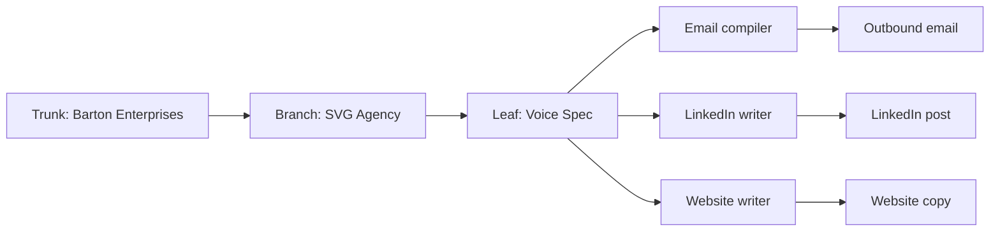
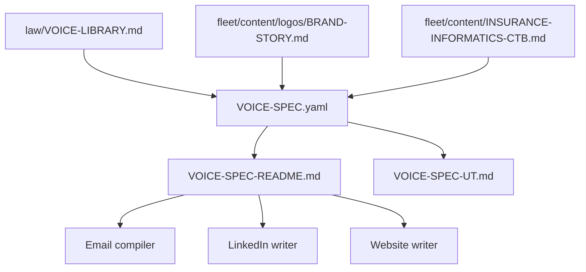

# Voice Spec
## Machine-readable Insurance Informatics voice spec and consumer contract for email, LinkedIn, and website writers.
### Status: BUILD
### Medium: process
### Business: svg-agency

---

## UT Checklist (Pre-Flight - per `law/UT_CHECKLIST.md` v1.2.0)

| # | Check | Status | Location |
|---|-------|--------|----------|
| 1 | PRD - what / why / who / scope / out-of-scope / success metric | [x] | Section 2 |
| 2 | OSAM - READ / WRITE / Process Composition / Join Chain / Forbidden / Query Routing filled | [x] | Section 5 |
| 3 | Component Status - every dep has green / yellow / red with 1-line state | [x] | Section 3 |
| 4 | Owner - human who fixes this at 2 AM | [x] | Section 1 |
| 5 | Live Dashboard - URL or explicit "N/A" | [x] | Section 3 |
| 6 | Kill Switch - exact command to stop the process | [x] | Section 8 |
| 7 | Logbook - last audit verdict + date (after certification only) | [ ] | Section 12 (BUILD phase; no certification yet) |
| 8 | FCEs Attached - which FCE runs structurally back this doc | [x] | Section 3c |
| 9 | BARs Referenced - every BAR this doc touches, with status | [x] | Section 3d |
| 10 | LBB Subjects Fed - which LBB subject(s) this doc's session logs go to | [x] | Section 3e |
| 11 | Geometry - CTB position + Hub-Spoke role + Altitude | [x] | Section 1b |
| 12 | Live Verification - every numeric count, cron, URL, command, BAR status grounded against the actual system | [x] | Section 9b |
| 13 | ctb_node - declared path on Barton Enterprises CTB trunk | [x] | Section 1 Identity |

---

# IDENTITY (Thing - what this IS)

Everything in this cluster answers: what exists? These are constants that don't change regardless of who reads this or when.

## 1. IDENTITY

| Field | Value |
|-------|-------|
| ID | PROC-VOICE-SPEC |
| Name | Voice Spec for Insurance Informatics |
| Medium | process |
| Business Silo | svg-agency |
| CTB Position | leaf -> fleet/content/VOICE-SPEC-UT.md |
| ORBT | BUILD |
| Strikes | 0 |
| Authority | inherited - `law/VOICE-LIBRARY.md`, `fleet/content/logos/BRAND-STORY.md`, `fleet/content/INSURANCE-INFORMATICS-CTB.md` |
| Last Modified | 2026-04-21 |
| BAR Reference | BAR-175 |
| Owner | Dave Barton |
| ctb_node | barton-enterprises/svg-agency/content/voice-spec |

### 1b. Geometry (Checklist item 11)

**CTB Position:** `barton-enterprises/svg-agency/content/voice-spec`

**Hub-Spoke Role:** Hub. This doc is the middle layer for voice. It feeds channel writers, which are spokes that should not invent tone.

**Altitude:** 30k tactical. This is the reusable content contract that multiple channels consume.



### HEIR (8 fields - Aviation Model, Bedrock S8)

| Field | Value |
|-------|-------|
| sovereign_ref | imo-creator |
| hub_id | voice-spec |
| ctb_placement | leaf |
| imo_topology | middle |
| cc_layer | CC-03 |
| services | law/VOICE-LIBRARY.md, fleet/content/logos/BRAND-STORY.md, fleet/content/INSURANCE-INFORMATICS-CTB.md |
| secrets_provider | none |
| acceptance_criteria | VOICE-SPEC.yaml is machine-readable, README explains consumer pattern, UT doc is complete, and downstream writers can fail closed on voice drift |

---

## 2. PURPOSE (PRD)

### WHAT
This doc package turns Dave Barton voice and Insurance Informatics positioning into a machine-readable spec, plus a consumer README and UT wrapper. It gives downstream writers one reusable source of tone, phrases, and positioning anchors.

### WHY
Without this spec, each channel re-derives voice from prose and drifts. That creates inconsistent email, LinkedIn, and website copy. With it, all three channels consume the same voice contract and stay aligned.

### WHO
- Email writers and the LCS compiler
- LinkedIn writers and platform reviewers
- Website and CF Pages writers
- Anyone auditing brand voice before publish

### SCOPE (in)
- Extract the voice constants into `fleet/content/VOICE-SPEC.yaml`
- Document downstream consumption in `fleet/content/VOICE-SPEC-README.md`
- Package the spec in a UT doc so the artifact is auditable
- Keep the extraction aligned with the source docs

### OUT-OF-SCOPE
- Rewriting `law/VOICE-LIBRARY.md`
- Changing the brand story source docs
- Editing worker code in this thread
- Adding new voice doctrine that is not already in the source docs

### SUCCESS METRIC
The spec is machine-readable, the README gives a concrete consumer pattern, and downstream writers can validate drafts against the same voice contract. See Section 10a.

---

## 3. RESOURCES

### Component Status Grid

| Component | HEIR (`hub_id · ctb · cc_layer`) | ORBT | Light | State |
|-----------|----------------------------------|------|-------|-------|
| `law/VOICE-LIBRARY.md` | `voice-library · branch · CC-03` | BUILD | green | Source voice prose and locked phrasing set |
| `fleet/content/logos/BRAND-STORY.md` | `brand-story · leaf · CC-03` | BUILD | green | Brand merger story and domain proof |
| `fleet/content/INSURANCE-INFORMATICS-CTB.md` | `ii-ctb · leaf · CC-03` | BUILD | green | Altitude and positioning backbone |
| `fleet/content/VOICE-SPEC.yaml` | `voice-spec-yaml · leaf · CC-03` | BUILD | yellow | Machine layer extracted from source docs |
| `fleet/content/VOICE-SPEC-README.md` | `voice-spec-readme · leaf · CC-03` | BUILD | yellow | Human consumer guide for downstream writers |
| `workers/lcs-hub/src/compiler-v2.ts` | `lcs-compiler · leaf · CC-04` | BUILD | yellow | Email compiler that should consume the spec |
| `fleet/content/PLATFORM-LINKEDIN.md` | `platform-linkedin · branch · CC-03` | BUILD | yellow | LinkedIn consumer pattern and voice audit gate |
| `docs/processes/CLIENT-CF-PAGE-RUNBOOK.md` | `client-cf-page · leaf · CC-04` | BUILD | yellow | Website / CF Pages consumer pattern |

### Live Dashboard

| Resource | URL | What it shows |
|----------|-----|---------------|
| Source docs | N/A | Static content references only |
| Voice spec bundle | N/A | Git-tracked content package |

### Dependencies

| Dependency | Type | What It Provides | Status |
|-----------|------|-----------------|--------|
| `law/VOICE-LIBRARY.md` | document | Tone, frames, forbidden phrases, required phrases, one-liners | DONE |
| `fleet/content/logos/BRAND-STORY.md` | document | Merger story and domain proof | DONE |
| `fleet/content/INSURANCE-INFORMATICS-CTB.md` | document | Positioning altitude and content backbone | DONE |
| `workers/lcs-hub/src/compiler-v2.ts` | worker code | Email compile path that should read the spec | DONE |
| `fleet/content/PLATFORM-LINKEDIN.md` | process doc | LinkedIn voice audit and publish rules | DONE |
| `docs/processes/CLIENT-CF-PAGE-RUNBOOK.md` | process doc | Website / CF Pages consumer pattern | DONE |

### Downstream Consumers

| Consumer | What It Needs |
|----------|--------------|
| Email compiler | Voice tone, forbidden phrases, required phrases, signature rules |
| LinkedIn writer | Public-facing direct voice, short declarative structure, CTA rules |
| Website writer | Category-first positioning, direct explanation, singular CTA |
| Brand reviewer | One place to compare copy against the same tone contract |

### Tools & Integrations

| Item | Type | Cost Tier | Credentials | What It Does |
|------|------|-----------|-------------|-------------|
| YAML parser | tool | Free | none | Reads `VOICE-SPEC.yaml` |
| Repo docs | reference | Free | none | Supplies source language and audit trail |
| Compiler / writers | code | Existing | none | Consume the spec in downstream channels |

### Secrets

| Secret | Doppler Project | Config | Used By |
|--------|----------------|--------|---------|
| none | none | none | No secrets required for the spec itself |

### 3c. FCEs Attached

| FCE Name | HEIR (`hub_id · ctb · cc_layer`) | ORBT | Run Directory | Latest P=1 | Rows | Status |
|----------|----------------------------------|------|--------------|------------|------|--------|
| N/A - source spec, not an FCE output | N/A | BUILD | N/A | N/A | N/A | yellow |

### 3d. BARs Referenced

| BAR | Title | HEIR (`bar-id · ctb · cc_layer`) | ORBT | Status | Relation |
|-----|-------|----------------------------------|------|--------|----------|
| BAR-175 | Voice Library | `bar-175 · leaf · CC-03` | BUILD | BUILD | source |
| BAR-302 | Website Map | `bar-302 · leaf · CC-03` | BUILD | BUILD | consumer |

### 3e. LBB Subjects Fed

| LBB Subject | HEIR (`subject-id · ctb · cc_layer`) | ORBT | What This Doc Writes | Frequency |
|-------------|--------------------------------------|------|---------------------|-----------|
| svg-sales-voice | `svg-sales-voice · branch · CC-03` | BUILD | Voice constants and extraction notes | on-change |
| svg-sales-frames | `svg-sales-frames · branch · CC-03` | BUILD | Positioning anchors and frame notes | on-change |

---

## 4. IMO - Input, Middle, Output

### Two-Question Intake (Bedrock S3)
1. **What triggers this?** - The need to reuse Dave Barton voice across email, LinkedIn, and website without drift.
2. **How do we get it?** - Extract the constants from `law/VOICE-LIBRARY.md`, `fleet/content/logos/BRAND-STORY.md`, and `fleet/content/INSURANCE-INFORMATICS-CTB.md`, then package them as a machine-readable spec.

### Input
- Source voice prose
- Brand merger story
- Insurance Informatics positioning backbone
- Existing consumer docs and compiler patterns

### Middle

| Step | Input | What Happens | Output | Tool Used |
|------|-------|-------------|--------|-----------|
| 1 | Source docs | Extract voice constants and positioning anchors | Structured spec fields | Manual authoring |
| 2 | Structured spec fields | Encode into YAML | `VOICE-SPEC.yaml` | YAML writer |
| 3 | YAML spec | Explain how consumers should apply it | `VOICE-SPEC-README.md` | Markdown writer |
| 4 | YAML + README + source docs | Package in a UT doc | `VOICE-SPEC-UT.md` | UNIFIED_TEMPLATE |

### Output
- A parseable voice spec
- A human README for consumer writers
- An auditable UT wrapper that can be reviewed and certified later

### Circle (Bedrock S5)
If any downstream writer drifts from the spec, the spec or the consumer needs to be repaired. The output feeds back into future drafts by tightening the same voice contract.

---

## 5. OSAM - DATA SCHEMA (Where the Data Lives)

### READ Access

| Source | What It Provides | Join Key |
|--------|-----------------|----------|
| `law/VOICE-LIBRARY.md` | Voice constants, banned phrases, required phrases, one-liners | section / anchor name |
| `fleet/content/logos/BRAND-STORY.md` | Merger story, domain proof, naming pattern | anchor name |
| `fleet/content/INSURANCE-INFORMATICS-CTB.md` | Positioning altitude and content backbone | altitude / section |
| `workers/lcs-hub/src/compiler-v2.ts` | Existing email compilation path | compiler function |
| `fleet/content/PLATFORM-LINKEDIN.md` | LinkedIn voice-audit pattern | voice audit rule |
| `docs/processes/CLIENT-CF-PAGE-RUNBOOK.md` | Website / CF Pages consumer pattern | route / variant |

### WRITE Access

| Target | What It Writes | When |
|--------|---------------|------|
| `fleet/content/VOICE-SPEC.yaml` | Machine-readable voice contract | After extraction |
| `fleet/content/VOICE-SPEC-README.md` | Consumer instructions | After extraction |
| `fleet/content/VOICE-SPEC-UT.md` | Auditable process doc | During package build |

### Process Composition



| Process ID | Name | Role in Composition | Status |
|-----------|------|---------------------|--------|
| N/A | Voice extraction | upstream source bundle | BUILD |
| N/A | Voice spec package | this doc package | BUILD |
| N/A | Channel writers | downstream consumers | BUILD |

### Join Chain

```text
law/VOICE-LIBRARY.md
  -> fleet/content/logos/BRAND-STORY.md
    -> fleet/content/INSURANCE-INFORMATICS-CTB.md
      -> fleet/content/VOICE-SPEC.yaml
        -> fleet/content/VOICE-SPEC-README.md
          -> email / LinkedIn / website writers
```

### Forbidden Paths

| Action | Why |
|--------|-----|
| Rewriting the source voice docs instead of extracting them | Violates the brief and mutates source doctrine |
| Letting consumers invent new tone markers | Creates channel drift |
| Ignoring forbidden phrases in downstream drafts | Breaks the voice gate |
| Making website, LinkedIn, and email use different positioning anchors | Splits the brand |

### Query Routing

| Question | Table | Column |
|----------|-------|--------|
| What tone should email use? | `VOICE-SPEC.yaml` | `voice_constants.posture` |
| What phrases are banned? | `VOICE-SPEC.yaml` | `voice_constants.forbidden_phrases` |
| What anchors define the brand? | `VOICE-SPEC.yaml` | `brand.positioning_anchors` |
| How should LinkedIn differ? | `VOICE-SPEC.yaml` | `channel_rules.linkedin` |
| How should website copy behave? | `VOICE-SPEC.yaml` | `channel_rules.website` |

---

## 6. DMJ - Define, Map, Join (law/doctrine/DMJ.md)

### 6a. DEFINE (Build the Key)

| Element | ID | Format | Description | C or V |
|---------|-----|--------|-------------|--------|
| Voice spec | VOICE-SPEC-01 | YAML | Machine-readable voice contract | C |
| Brand anchors | VOICE-SPEC-02 | YAML list | Merger story, domain proof, naming pattern, career discipline, defense stack | C |
| Voice constants | VOICE-SPEC-03 | YAML map | Persona, posture, rules, phrases | C |
| Channel rules | VOICE-SPEC-04 | YAML map | Email, LinkedIn, website consumer rules | C |
| Draft copy | VOICE-SPEC-05 | text | Actual channel content | V |
| CTA | VOICE-SPEC-06 | text | Booking, follow, or page action | V |

### 6b. MAP (Connect Key to Structure)

| Source | Target | Transform |
|--------|--------|-----------|
| Voice prose | YAML spec | Extract and normalize |
| Brand story | positioning anchors | Map into machine fields |
| CTB doc | channel altitude framing | Map into website / content hierarchy |
| YAML spec | writer draft | Apply tone and phrase constraints |
| Channel rules | published copy | Validate before release |

### 6c. JOIN (Path to Spine)

| Join Path | Type | Description |
|-----------|------|-------------|
| `VOICE-LIBRARY.md` -> `VOICE-SPEC.yaml` | direct | Source prose becomes machine structure |
| `BRAND-STORY.md` -> `VOICE-SPEC.yaml` | direct | Brand merger story becomes positioning anchors |
| `INSURANCE-INFORMATICS-CTB.md` -> `VOICE-SPEC.yaml` | direct | Altitude and framing become channel guidance |
| `VOICE-SPEC.yaml` -> `scripts/gen-voice-spec.mjs` -> generated worker bridges | direct | Same voice contract feeds all three channels without runtime YAML parsing |

Back-propagate to 6a if any anchor, phrase, or channel rule cannot be defined without guessing.

---

## 7. CONSTANTS & VARIABLES (Bedrock S2)

### Constants (structure - never changes)
- Insurance Informatics is the brand destination.
- The voice is direct, confident, challenging, blunt about reality, and zero desperation.
- The forbidden phrase set stays hard-closed.
- The required phrase set keeps the category and frame visible.
- Email, LinkedIn, and website all consume the same voice contract.
- The checked-in generated worker bridges are the runtime path; the YAML feeds the generator.

### Variables (fill - changes every run/cycle)
- Specific company facts used in a draft
- Specific CTA URL or booking link
- Channel-specific length and formatting
- Audience-specific examples
- Publish timing

---

## 8. STOP CONDITIONS (Bedrock S6)

| Condition | Action |
|-----------|--------|
| Spec contradicts `law/VOICE-LIBRARY.md` | HALT |
| Brand anchors cannot be resolved from the source docs | HALT |
| Channel writer cannot parse the YAML | HALT and fall back to the prose source |
| A draft contains a forbidden phrase | REWRITE before publish |
| Email, LinkedIn, and website drift onto different positioning | HALT and realign |

### Kill Switch

```bash
Move-Item -LiteralPath fleet/content/VOICE-SPEC.yaml -Destination fleet/content/VOICE-SPEC.yaml.disabled
```

---

# GOVERNANCE (Change - how this is controlled)

## 9. VERIFICATION

```text
1. Parse VOICE-SPEC.yaml and regenerate worker bridges
   expected: YAML loads cleanly, generated files are refreshed, and the output is a no-op when unchanged.
2. Validate a draft against forbidden_phrases
   expected: any draft containing a banned phrase fails closed.
3. Apply the same source fact to email, LinkedIn, and website consumers
   expected: all three outputs preserve the same direct, category-first voice.
```

**Three Primitives Check (Bedrock S1):**
1. **Thing:** Does the spec file exist and parse?
2. **Flow:** Do downstream writers read the same file?
3. **Change:** Does the spec actually change channel output so voice stays aligned?

## 9b. Live Verification Log (Checklist item 12)

| Claim | Section | Source of Truth | Verification Command | [x] | Last Check | Value |
|-------|---------|-----------------|----------------------|-----|-----------|-------|
| Voice constants captured in YAML | Section 4, Section 6 | `fleet/content/VOICE-SPEC.yaml` | open file and inspect keys | [x] | 2026-04-21 | brand, voice_constants, channel_rules present |
| Brand anchors traced to source docs | Section 4, Section 6 | `fleet/content/logos/BRAND-STORY.md` + `fleet/content/INSURANCE-INFORMATICS-CTB.md` | read source docs and compare anchors | [x] | 2026-04-21 | merger story + naming pattern + CTB grounding present |
| Consumer pattern documented | Section 3, Section 4 | `fleet/content/VOICE-SPEC-README.md` | read README example section | [x] | 2026-04-21 | email, LinkedIn, website load generated worker bridges |
| No runtime numeric claims embedded | Section 3, Section 9 | spec package | inspect files | [x] | 2026-04-21 | static content package only |

Rule: if any claim drifts from the source docs, the spec is provisional until repaired.

## 10. ANALYTICS

### 10a. Metrics

| Metric | Unit | Baseline | Target | Tolerance |
|--------|------|----------|--------|-----------|
| Spec parse success | pass/fail | BASELINE | pass | 0 failures |
| Forbidden phrase coverage | count | BASELINE | complete | 0 missing |
| Channel rule coverage | count | BASELINE | 3 channels | exact 3 |
| Downstream consumer adoption | count | BASELINE | 3 consumers | 0 missing |

### 10b. Sigma Tracking (Bedrock S2)

| Metric | Run 1 | Run 2 | Run 3 | Trend | Action |
|--------|-------|-------|-------|-------|--------|
| Spec parse success | TBD | TBD | TBD | TIGHTENING | keep |
| Forbidden phrase coverage | TBD | TBD | TBD | TIGHTENING | keep |
| Consumer adoption | TBD | TBD | TBD | TIGHTENING | keep |

### 10c. ORBT Gate Rules

| From | To | Gate |
|------|-----|------|
| BUILD | OPERATE | YAML parses, README explains consumers, UT doc is complete, and three downstream writers can use the same spec |
| OPERATE | REPAIR | Any channel drifts from the spec |
| REPAIR | OPERATE | Repair the spec or consumer, then re-validate |
| Any (Strike 3) | TROUBLESHOOT/TRAIN | Repeated drift means the voice contract or consumer pattern is wrong |

---

## 11. EXECUTION TRACE

| Field | Format | Required |
|-------|--------|----------|
| trace_id | UUID | Yes |
| run_id | UUID | Yes |
| step | action name | Yes |
| target | measurable | Yes |
| actual | measurable | Yes |
| delta | the gap | Yes |
| status | done / failed / skipped | Yes |
| error_code | text or null | If failed |
| error_message | text or null | If failed |
| tools_used | JSON array | Yes |
| duration_ms | integer | Yes |
| cost_cents | integer | Yes |
| timestamp | ISO-8601 | Yes |
| signed_by | agent or manual | Yes |

| trace_id | run_id | step | target | actual | delta | status | error_code | error_message | tools_used | duration_ms | cost_cents | timestamp | signed_by |
|----------|--------|------|--------|--------|-------|--------|------------|---------------|------------|-------------|------------|-----------|-----------|
| PROC-VOICE-SPEC-001 | 2026-04-21-thread-1 | build-voice-spec-bundle | voice spec package | YAML + README + UT draft | none | done | null | null | ["manual authoring", "repo docs"] | pending manual timing | pending manual accounting | 2026-04-21 | Codex |

---

## 12. LOGBOOK (After Certification Only)

No logbook during BUILD.

### Birth Certificate

| Field | Value |
|-------|-------|
| heir_ref | pending certification |
| orbt_entered | BUILD |
| orbt_exited | pending |
| action | pending auditor certification |
| gates_passed | pending |
| signed_by | pending |
| signed_at | pending |

---

## 13. FLEET FAILURE REGISTRY

| Pattern ID | Location | Error Code | First Seen | Occurrences | Strike Count | Status |
|-----------|----------|-----------|-----------|-------------|-------------|--------|
| FP-001 | voice package | forbidden phrase drift | 2026-04-21 | 0 | 0 | OPEN |

Strike 1: Repair. Strike 2: Scrutiny. Strike 3: Troubleshoot/Train -> Airworthiness Directive.

---

## 14. MAINTENANCE LOGBOOK (doc's own logbook - FAA-grade)

| Date (ISO) | Actor | Action | What Was Done | Evidence | LBB Record |
|-----------|-------|--------|---------------|----------|------------|
| 2026-04-21 | Codex | EDIT | Built the voice spec bundle: YAML spec, consumer README, UT wrapper, and generated worker bridges. | `fleet/content/VOICE-SPEC.yaml`, `fleet/content/VOICE-SPEC-README.md`, `fleet/content/VOICE-SPEC-UT.md`, `workers/*/src/voice-spec.generated.ts` | pending |

---

## Document Control

| Field | Value |
|-------|-------|
| Created | 2026-04-21 |
| Last Modified | 2026-04-21 |
| Version | 1.0.0 |
| Template Version | 2.7.0 |
| Medium | process |
| US Validated | pending |
| Governing Engine | law/UNIFIED_TEMPLATE.md + law/UT_CHECKLIST.md |
