# CL Schema ERD

> **Source of Truth:** Neon PostgreSQL
> **Verification Mode:** Read-Only
> **Verification Date:** 2026-02-04
> **Tables:** 25 | **Columns:** 280+ | **Active Records:** 106,065

**Updated: 2026-02-04**

## Recent Intake: Hunter DOL Enrichment (2026-02-04)

| Metric | Value |
|--------|-------|
| Records Minted | 54,155 |
| Source System | `hunter_dol_enrichment` |
| Source Table | `dol.ein_urls` |
| States | OH, PA, VA, MD, NC, KY, DC, WV |

See: `docs/runs/RUN-2026-02-04-HUNTER-DOL-INTAKE.md`

## Category Exclusion (2026-01-29)

The following categories have been excluded from the active dataset and moved to `*_excluded` tables:

| Category | Count Excluded | Description |
|----------|----------------|-------------|
| EDUCATIONAL_INSTITUTION | 1,332 | Schools, universities, e-learning |
| FINANCIAL_SERVICES | 1,748 | Edward Jones, wealth mgmt, advisors |
| GOVERNMENT_ENTITY | 466 | Government offices, law enforcement |
| HEALTHCARE_FACILITY | 1,663 | Medical practices, hospitals, clinics |
| RELIGIOUS_ORGANIZATION | 118 | Churches, religious institutions |
| INSURANCE_ENTITY | 0 | (No specific matches in dataset) |
| **TOTAL EXCLUDED** | **5,327** | **10.1% of original dataset** |

## Visual ERD (Mermaid)

```mermaid
erDiagram
    COMPANY_IDENTITY ||--o{ COMPANY_NAMES : "has"
    COMPANY_IDENTITY ||--o{ COMPANY_DOMAINS : "has"
    COMPANY_IDENTITY ||--o{ IDENTITY_CONFIDENCE : "has"
    COMPANY_IDENTITY ||--o{ DOMAIN_HIERARCHY : "parent_of"

    COMPANY_IDENTITY {
        uuid company_unique_id PK
        uuid sovereign_company_id
        text company_name
        text company_domain
        text linkedin_company_url
        text source_system
        text final_outcome
        text entity_role
        text eligibility_status
        uuid outreach_id FK
        uuid sales_process_id FK
        uuid client_id FK
        timestamptz outreach_attached_at
        timestamptz sales_opened_at
        timestamptz client_promoted_at
    }

    COMPANY_NAMES {
        uuid name_id PK
        uuid company_unique_id FK
        text name_variant
        text name_type
    }

    COMPANY_DOMAINS {
        uuid domain_id PK
        uuid company_unique_id FK
        text domain
        text domain_type
    }

    IDENTITY_CONFIDENCE {
        uuid confidence_id PK
        uuid company_unique_id FK
        integer confidence_score
        text confidence_method
    }

    DOMAIN_HIERARCHY {
        uuid hierarchy_id PK
        text domain
        uuid parent_company_id FK
        uuid child_company_id FK
        text relationship_type
        integer confidence_score
    }

    COMPANY_CANDIDATE {
        uuid candidate_id PK
        text company_name
        text company_domain
        text source_system
        text verification_status
        text state_code
    }

    COMPANY_IDENTITY_BRIDGE {
        uuid bridge_id PK
        text source_id
        uuid sovereign_company_id FK
        text source_system
    }

    COMPANY_IDENTITY_ARCHIVE {
        uuid company_unique_id PK
        text final_outcome
        text archive_reason
        timestamptz archived_at
    }

    CL_ERRORS {
        uuid error_id PK
        uuid company_unique_id FK
        text pass_name
        text failure_reason_code
        text final_outcome
    }

    CL_ERRORS_ARCHIVE {
        uuid error_id PK
        uuid company_unique_id
        text pass_name
        timestamptz archived_at
    }

    COMPANY_IDENTITY_EXCLUDED {
        uuid company_unique_id PK
        text company_name
        text company_domain
        text exclusion_category
        timestamptz excluded_at
    }

    COMPANY_NAMES_EXCLUDED {
        uuid name_id PK
        uuid company_unique_id FK
        text name_variant
    }

    COMPANY_DOMAINS_EXCLUDED {
        uuid domain_id PK
        uuid company_unique_id FK
        text domain
    }

    IDENTITY_CONFIDENCE_EXCLUDED {
        uuid confidence_id PK
        uuid company_unique_id FK
        integer confidence_score
    }
```



## Tables Summary

### Active Tables

| Table | Rows | Purpose |
|-------|------|---------|
| company_identity | 106,065 | Master table - PASS companies only |
| company_identity_archive | 22,263 | Archived FAIL companies |
| company_names | ~125,000 | Name variants per company |
| company_domains | ~106,065 | Domain records for active companies |
| identity_confidence | ~106,065 | Confidence scores |
| domain_hierarchy | 4,705 | Parent-child relationships |
| company_candidate | 62,162 | Intake candidates |
| company_identity_bridge | 71,820 | Source ID to Sovereign ID mapping |
| cl_errors | 0 | Work queue (empty at steady state) |
| cl_errors_archive | 16,103 | Archived error history |
| cl_err_existence | 7,985 | Legacy existence errors |

### Excluded Tables (Category Filtered)

| Table | Rows | Purpose |
|-------|------|---------|
| company_identity_excluded | 5,327 | Companies excluded by category filter |
| company_names_excluded | 7,361 | Name variants for excluded companies |
| company_domains_excluded | 5,327 | Domain records for excluded companies |
| identity_confidence_excluded | 5,327 | Confidence scores for excluded companies |

**Exclusion Categories:** EDUCATIONAL_INSTITUTION, FINANCIAL_SERVICES, GOVERNMENT_ENTITY, HEALTHCARE_FACILITY, RELIGIOUS_ORGANIZATION, INSURANCE_ENTITY

### Source System Distribution

| Source System | Count | % | Description |
|---------------|-------|---|-------------|
| `hunter_dol_enrichment` | 54,155 | 51.1% | Hunter.io DOL Form 5500 enrichment (2026-02-04) |
| `clay_import` | ~30,000 | 28.3% | Clay import (legacy) |
| `CLAY_MULTI_*` | ~21,910 | 20.6% | Multi-state Clay batches |

## Foreign Keys

```
cl.company_domains.company_unique_id -> cl.company_identity.company_unique_id
cl.company_names.company_unique_id -> cl.company_identity.company_unique_id
cl.identity_confidence.company_unique_id -> cl.company_identity.company_unique_id
```

## Views

| View | Rows | Purpose |
|------|------|---------|
| v_company_promotable | 106,065 | Canonical source for Outreach |
| v_company_lifecycle_status | 106,065 | Lifecycle stage + pointers (for UI/Lovable.DAVE) |
| v_company_identity_eligible | 106,065 | Eligible companies |
| v_identity_gate_summary | 1 | Gate audit summary |

### v_company_lifecycle_status (UI View)
| Column | Type | Notes |
|--------|------|-------|
| sovereign_company_id | uuid | |
| company_name | text | |
| company_domain | text | |
| outreach_id | uuid | Pointer to Outreach |
| sales_process_id | uuid | Pointer to Sales |
| client_id | uuid | Pointer to Client |
| has_outreach | boolean | Derived |
| has_sales | boolean | Derived |
| is_client | boolean | Derived |
| lifecycle_stage | text | PROSPECT -> OUTREACH -> SALES -> CLIENT |

---

## Table Details

### cl.company_identity (106,065 rows) - MASTER
| Column | Type | Nullable | Notes |
|--------|------|----------|-------|
| company_unique_id | uuid | NO | PK |
| sovereign_company_id | uuid | YES | Sovereign ID |
| company_name | text | NO | |
| company_domain | text | YES | |
| linkedin_company_url | text | YES | |
| source_system | text | NO | |
| final_outcome | text | YES | PASS only |
| final_reason | text | YES | ELIGIBLE_VERIFIED |
| entity_role | text | YES | PARENT_ANCHOR / CHILD_OPERATING_UNIT |
| eligibility_status | text | YES | ELIGIBLE |
| existence_verified | boolean | YES | |
| verified_at | timestamptz | YES | |
| **outreach_id** | uuid | YES | Write-once pointer to Outreach |
| **sales_process_id** | uuid | YES | Write-once pointer to Sales |
| **client_id** | uuid | YES | Write-once pointer to Client |
| outreach_attached_at | timestamptz | YES | Auto-set on first write |
| sales_opened_at | timestamptz | YES | Auto-set on first write |
| client_promoted_at | timestamptz | YES | Auto-set on first write |

**Trigger:** `trg_write_once_pointers` - Blocks updates to non-NULL pointer columns.

### cl.company_identity_archive (22,263 rows) - ARCHIVED FAIL
Same structure as company_identity plus:
| Column | Type | Notes |
|--------|------|-------|
| archived_at | timestamptz | When archived |
| archive_reason | text | FAIL_CLEANUP |
| final_outcome | text | FAIL |
| final_reason | text | RESTRICTED_NONPROFIT, EXISTENCE_NOT_VERIFIED, BLOCKED_NO_DOMAIN, EXCLUDED_POLICY, ROLE_UNCERTAIN |

### cl.domain_hierarchy (4,705 rows)
| Column | Type | Notes |
|--------|------|-------|
| hierarchy_id | uuid | PK |
| domain | text | Shared domain |
| parent_company_id | uuid | Parent company |
| child_company_id | uuid | Child company |
| relationship_type | text | CHILD_OPERATING_UNIT, AMBIGUOUS_UNRESOLVED |
| confidence_score | integer | 0-100 |
| resolution_method | text | How determined |

### cl.cl_errors (0 rows) - WORK QUEUE
| Column | Type | Notes |
|--------|------|-------|
| error_id | uuid | PK |
| company_unique_id | uuid | |
| pass_name | text | existence, collision, etc. |
| failure_reason_code | text | |
| final_outcome | text | PASS or FAIL |
| resolved_at | timestamptz | When resolved |

---

## Archive Tables

All archive tables mirror their source tables with additional columns:
- `archived_at` - When the record was archived
- `archive_reason` - Why it was archived

| Archive Table | Rows |
|--------------|------|
| company_identity_archive | 22,263 |
| company_domains_archive | 18,328 |
| company_names_archive | 17,764 |
| identity_confidence_archive | 19,850 |
| domain_hierarchy_archive | 1,878 |
| cl_errors_archive | 16,103 |

---

## Legacy Reference (ASCII)

<details>
<summary>Click to expand ASCII ERD (preserved for reference)</summary>

```
+---------------------------------------------------------------------+
|                     CL SCHEMA (Company Lifecycle)                    |
+---------------------------------------------------------------------+

  +----------------------------+
  |   company_identity         |  <- MASTER TABLE (106,065 PASS)
  |   ======================   |
  |   company_unique_id [PK]   |
  |   sovereign_company_id     |
  |   company_name             |
  |   company_domain           |
  |   linkedin_company_url     |
  |   final_outcome = PASS     |
  |   entity_role              |
  |   eligibility_status       |
  |   ------------------------ |
  |   LIFECYCLE POINTERS:      |  <- Write-once (trigger enforced)
  |   outreach_id              |
  |   sales_process_id         |
  |   client_id                |
  |   outreach_attached_at     |
  |   sales_opened_at          |
  |   client_promoted_at       |
  +-----------+----------------+
              |
    +---------+---------+-----------+
    |         |         |           |
    v         v         v           v
+--------+ +--------+ +----------+ +--------------+
|company | |company | |identity  | |domain        |
|_names  | |_domains| |_confidence| |_hierarchy   |
|(78,204)| |(51,910)| | (51,910) | |   (4,705)   |
+--------+ +--------+ +----------+ +--------------+

  +----------------------------+
  | company_identity_archive   |  <- ARCHIVED FAIL (22,263)
  |   final_outcome = FAIL     |
  +----------------------------+

  +----------------------------+
  |     cl_errors_archive      |  <- ARCHIVED ERRORS (16,103)
  +----------------------------+

  +----------------------------+
  |       cl_errors            |  <- WORK QUEUE (0 at steady state)
  +----------------------------+
```

</details>
