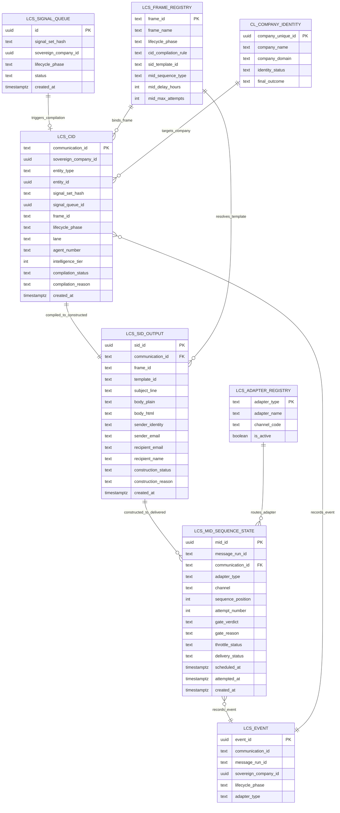

# LCS Pipeline ERD — SH-LCS-PIPELINE

> **Sub-Hub:** SH-LCS-PIPELINE
> **Format:** Mermaid (per DOCUMENTATION_ERD_DOCTRINE v1.0.0)
> **Created:** 2026-03-03
> **Migration:** 005_lcs_cid_sid_mid.sql

---

## Entity Relationship Diagram

---

## Relationship Descriptions

| From | To | Cardinality | Description |
|------|----|-------------|-------------|
| LCS_SIGNAL_QUEUE | LCS_CID | 0..1 : 1 | Each signal may produce one CID compilation (or none if blocked) |
| LCS_FRAME_REGISTRY | LCS_CID | 1 : 0..N | Each frame may be bound to many CID records |
| CL_COMPANY_IDENTITY | LCS_CID | 1 : 0..N | Each company may have many communications |
| LCS_CID | LCS_SID_OUTPUT | 1 : 1 | Each COMPILED CID produces exactly one SID output |
| LCS_FRAME_REGISTRY | LCS_SID_OUTPUT | 1 : 0..N | Each frame may be used in many SID constructions |
| LCS_SID_OUTPUT | LCS_MID_SEQUENCE_STATE | 1 : 0..N | Each CONSTRUCTED SID may produce multiple delivery attempts |
| LCS_ADAPTER_REGISTRY | LCS_MID_SEQUENCE_STATE | 1 : 0..N | Each adapter handles many delivery attempts |
| LCS_CID | LCS_EVENT | 0..N : 1 | CID communication_id carried to final CET record |
| LCS_MID_SEQUENCE_STATE | LCS_EVENT | 0..N : 1 | MID message_run_id carried to final CET record |

All relationships are **by value** (no foreign key constraints). Tables are independently queryable.

---

## Document Control

| Field | Value |
|-------|-------|
| Hub | HUB-CL-001 |
| Sub-Hub | SH-LCS-PIPELINE |
| Version | 1.0.0 |
| Status | ACTIVE |
| Created | 2026-03-03 |
